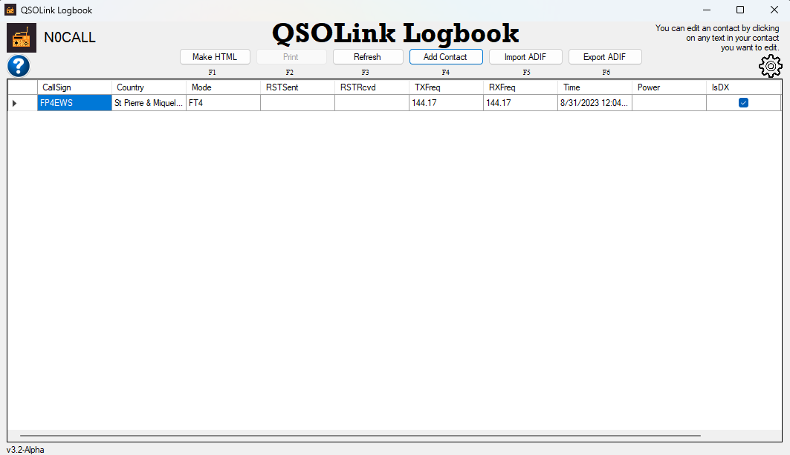

#  QsoLink Logbook

   
   
   
    
   
   
    
   
   
    
    
   

## Application will request an admin privileges, because of the way, it writes data to its own program files folder. This is an temporary bug!

## About

QsoLink Logbook is a user-friendly digital QSO logging software designed for ease of use.

## Download
Firstly, install dotNet framework: https://dotnet.microsoft.com/en-us/download/dotnet-framework/net48

And now you can just download the official releases with installers from the [Releases section](https://github.com/Lopastudio/QSOLink-Logbook/releases) or by clicking the button below:

### Bug / Feature Request

If you find a bug or want to request a new feature, please open an issue [here](https://github.com/Lopastudio/QSOLink-Logbook/issues/new).

## To-Do List

| Task                                           | Status |
| ---------------------------------------------- | ------ |
| Add the REMOVE button.                         | ✅     |
| Improve the user interface.                    | ❌     |
| Add PDF or RTF export option.                  | ✅     |
| Clean up and optimize the code.                | ❌     |
| Create an installer.                           | ✅     |
| Fix known bugs.                                | ❌     |

## Known Bugs

| Bug Description                                | Status |
| ---------------------------------------------- | ------ |
| To edit, click on the row's text, not the row itself. |❌      |
| Alpha 2.1: The app needs to be launched as an administrator when using the installer. | ❌   |
| Removing a contact assigns the wrong index number. | ✅     |

## Support

If you appreciate my work, please consider donating.

## Developer Section

### Compiling

1. Clone the project: `git clone https://github.com/Lopastudio/QSOLink-Logbook/`
2. Download and install Visual Studio 2022 with the dotNET Desktop Development package.
3. Open the project in Visual Studio, switch to the Release configuration.
4. Build the project using `CTRL + B` or by clicking "Build QSOLink Logbook" in the Build tab.
5. The compiled build will be in the `Bin/Release` folder of the project.

### Contribution

If you'd like to contribute, follow these steps:
1. Fork the repo
2. Make your changes
3. Commit and push to your branch
4. Create a Pull Request

## License

This project is licensed under the [Apache License 2.0](https://github.com/Lopastudio/QSOLink-Logbook/blob/master/LICENSE.txt).
